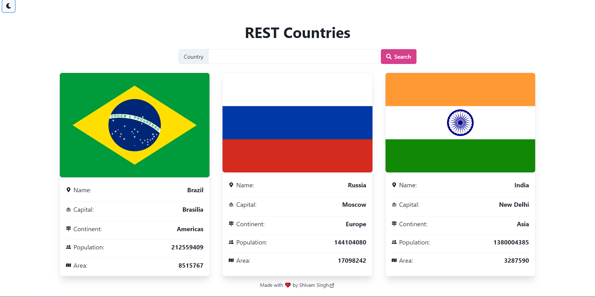
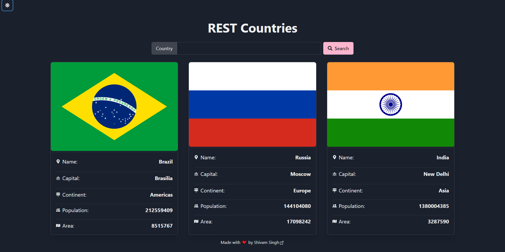

## Introduction

A simple website which shows the information about a specific country in the form of cards.
The information includes the Name of the country, the capital of the country, the continent in which it is located, the population and its area.  
**Technologies Used** : React JS, Node JS, Chakra UI, React Icons and Axios.  
**API Used** : REST Countries API.





## Fetching the data

```js:title=./src/CountryData.js
     const CountryData = () => {
  const [countryName, setCountryName] = useState('');
  const [countryData, setCountryData] = useState([]);

  async function getData() {
    try {
      const response = await axios.get(
        `https://restcountries.com/v3.1/name/${countryName}`
      );
      setCountryData((countryData) => [response.data, ...countryData]);
      console.log(countryData);
    } catch (error) {
      console.error(error);
    }
  }

```

Here data is being fetched from REST Api with the help of Axios using the **get** method. **countryName** is the name of the variable in which the input (name of the country) given by the user is stored.
**countryData** is the array in which all the data is stored.

> To visit the site <a href="https://shivmsingh.github.io/rest-countries/" target="_blank">click here</a>  
> To checkout the full source code <a href="https://github.com/shivmsingh/rest-countries" target="_blank">click here</a>
