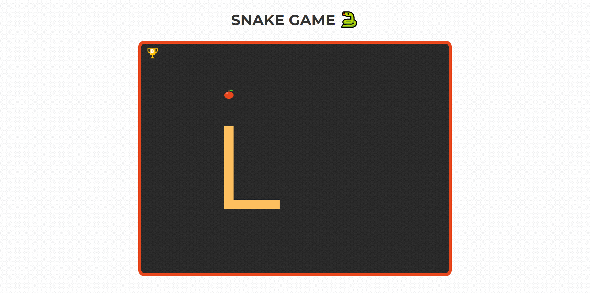

## Introduction.

A snake game is a simple game where a snake moves around a box trying to eat an apple. Once it successfully eats the apple, the length of the snake increases and the movement becomes faster.

Then the game is over when the snake runs into itself or any of the four walls of the box.

## Initialising the canvas.

```html:title=./index.html
 <canvas id="snakeCanvas"></canvas>


```

Initialised the canvas with an id **snakeCanvas**

## Initialising the Snake

```js:title=./js/main.js
   snake = {
    init_len: 5,
    color: "#FDBF5F",
    cells: [],
    size: 5,
    direction: "right",


    createSnake: function () {
      for (var i = this.init_len; i >= 0; i--) {
        this.cells.push({
          x: i,
          y: 0
        });
      }
    },

```

Where **init_len** is the initial lenght of the canvas, the **cells** array will store the position of the snake and the initial direction of snake is right.  
Inside the **createSnake** function the initial cordinates of the position of snake are being pushed inside the cells array.  
Since, the initial position of the snake is horizontal the cordinates of y remain 0 and x varies from init_len to 0.

## Taking input from the keyboard.

```js:title=./js/main.js
     function keyPressed(e) {
    if (e.key == "ArrowRight" && snake.direction != "left") {
      snake.direction = "right";
    } else if (e.key == "ArrowLeft" && snake.direction != "right") {
      snake.direction = "left";
    } else if (e.key == "ArrowDown" && snake.direction != "up") {
      snake.direction = "down";
    } else if (e.key == "ArrowUp" && snake.direction != "down") {
      snake.direction = "up";
      console.log(e.key);
    }
  }

```

The **keyPressed** function receives a parameter **e** which contains all the information about the key being pressed.
But we are only interested in the key which is pressed so we will access it by e.key. <br />
if e.key = ArrowRight the direction of the snake will become right and so on.

> To play the game <a href="https://shivmsingh.github.io/snake-game/" target="_blank">click here</a>  
> To checkout the full source code <a href="https://github.com/shivmsingh/snake-game" target="_blank">click here</a>
